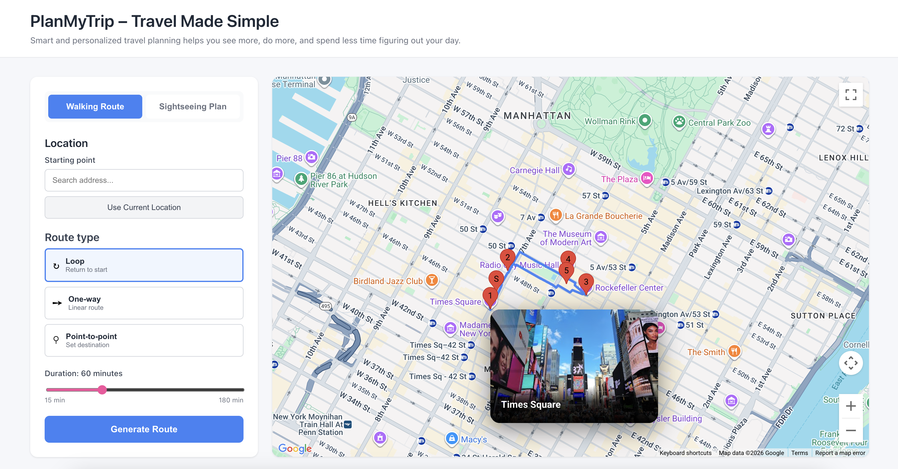
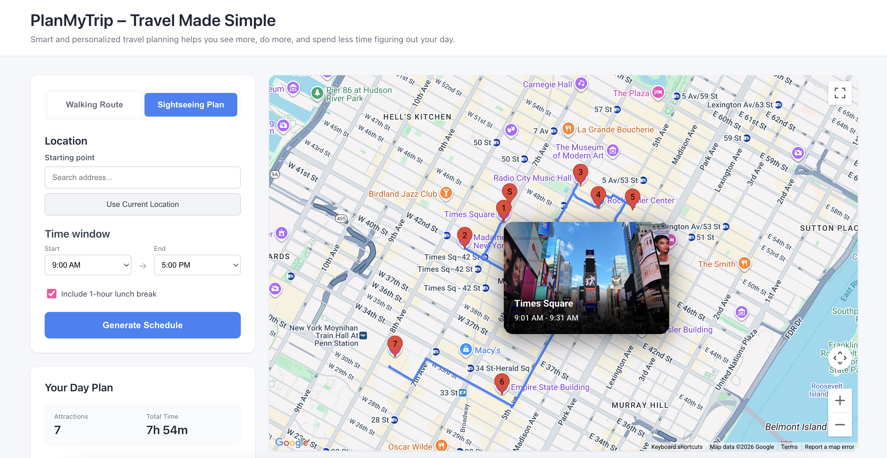

# PlanMyTrip - Travel Made Simple

**Author:** Martyna Glowacka 
**Tech:** Java 17, Spring Boot, React, Google Maps API  
**Links:** [Frontend](https://github.com/martynaglowacka/planmytrip-frontend) | [Demo Video](https://youtu.be/SI_svfJm1Nk)

---

## Overview
| Walking Routes | Sightseeing Schedules |
|:---:|:---:|
|  |  |
| *60-minute loop with 5 POIs* | *Full-day itinerary (9 AM - 5 PM)* |

A dual-mode trip planner that generates personalized routes and schedules for city exploration.

A dual-mode trip planner that generates personalized routes and schedules for city exploration.

**Mode 1: Walking Routes** (15-180 minutes)
- Generates optimized walking routes for short city trips
- Three route types: Loop (return to start), One-Way (exploration), Point-to-Point (A to B)
- Maximizes interesting POIs within time budget
- Real-time directions

**Mode 2: Sightseeing Schedules** (multi-hour day plans)
- Creates full-day itineraries with specific arrival/departure times
- Includes lunch break scheduling
- Calculates realistic visit durations per attraction type
- Time-window planning (e.g. 9 AM - 5 PM)

**Shared Features:**
- Preference-based filtering: boost or exclude 15+ POI categories
- Real-time Google Maps integration
- Intelligent two-layer caching system
- Cost optimization (83.8% cache hit rate)

---

## Algorithms

| Algorithm                | Use Case              | How It Works                                | Complexity |
|--------------------------|-----------------------|---------------------------------------------|------------|
| **A* Pathfinding**       | Point-to-point routes | Custom heuristic: distance + POI quality    | O(b^d)     |
| **Two-Point Loop**       | Circular routes       | Iterative outward extension, optimal return | O(n²×k)    |
| **Greedy Density-Aware** | One-way routes        | Rewards POI clusters (300m radius)          | O(n²×k)    |
| **Time-Aware Scheduler** | Full-day plans        | Greedy with realistic visit times + breaks  | O(n²)      |

**Key Innovation:** Density bonusing creates coherent "neighborhood" routes instead of scattered POIs.

---

## Performance

### Route Generation Times
| Type              | Time   | POIs | Location     |
|-------------------|--------|------|--------------|
| Simple (30 min)   | 17s    | 2    | NYC          |
| Medium (60 min)   | 13s    | 5    | NYC          |
| Complex (120 min) | 15s    | 9    | NYC          |
| International     | 22-32s | 4-5  | London/Paris |

*Times include real Google API calls + iterative optimization*

### Cache Performance
- **Hit rate:** 83.8%
- **API calls avoided:** 4,566 / 5,448
- **Cost reduction:** 5.6x vs. no caching
- **Architecture:** Two-layer (walking times: 892 entries, polylines: 14 entries)

**Context:** Dynamic routing apps typically achieve 60-75% cache hit rates. 83.8% demonstrates effective cache design despite high request variability.

---

## Tech Stack

**Backend:** Java 17, Spring Boot 3.0, RESTful API  
**Frontend:** React 18, Google Maps JavaScript API  
**APIs:** Google Places, Google Routes  
**Architecture:** Service layer pattern with two-layer caching

**Key Files:**
- `OptimizedRouteService.java` - Algorithm orchestrator
- `AStarRouteService.java` / `TwoPointLoopService.java` - Route algorithms
- `SightseeingSchedulerService.java` - Day schedule generator
- `WalkingTimeCache.java` - Caching layer 

---

## Quick Start

```bash
# Backend
./mvnw spring-boot:run

# Frontend (separate terminal)
cd frontend && npm install && npm start
```

**Configure:** Add Google API key to `application.properties`

---

## API Examples

### Walking Route
```bash
POST /api/routes/optimized
{
  "startLat": 40.7589, "startLng": -73.9851,
  "minutes": 60, "routeShape": "loop",
  "preferences": { "shopping": 0.0, "hidden_gem": 3.0 }
}
```

### Sightseeing Schedule
```bash
POST /api/routes/sightseeing
{
  "startLat": 40.7589, "startLng": -73.9851,
  "startTime": "09:00", "endTime": "17:00",
  "includeLunchBreak": true,
  "preferences": { "categoryWeights": { "museum": 2.0 } }
}
```

**Categories:** landmark, park, museum, shopping, restaurant, hidden_gem, etc.  
**Weights:** 0.0 (exclude), 1.0 (neutral), 2.0+ (boost)

---

## Key Challenges Solved

**1. Category Exclusion Bug**  
POIs with multiple categories bypassed exclusions. Fixed by checking for any excluded category before applying boosts.

**2. API Cost (83.8% cache hit rate)**  
Reduced costs 5.6x through two-layer caching: walking times (reusable) + polylines (route-specific).

**3. TSP Complexity**  
Used greedy nearest-neighbor instead of optimal O(n!) TSP. <5% quality loss, 1000x faster for <15 POIs.

**4. Realistic Visit Times**  
Created smart duration calculator: museums (90 min), parks (30 min), churches (20 min) vs. fixed 30 min. Visit time adjusted based on real-world data. 

**5. Error Handling**  
Centralized exception handling via `@ControllerAdvice`: catches Google API failures, network failures, validates request parameters. Returns structured JSON error responses with specific codes (e.g., `GOOGLE_API_SERVER_ERROR`, `SCHEDULING_ERROR`) for frontend handling.

---

## Future Work

- Async route generation
- ML-based POI recommendations
- Multi-day trip planning
- Public transit integration

---

## Contact

**GitHub:** martynaglowacka
**Email:** mglowacka@princeton.edu

---

**Repositories:** [Backend](https://github.com/martynaglowacka/planmytrip-backend) | [Frontend](https://github.com/martynaglowacka/planmytrip-frontend)
